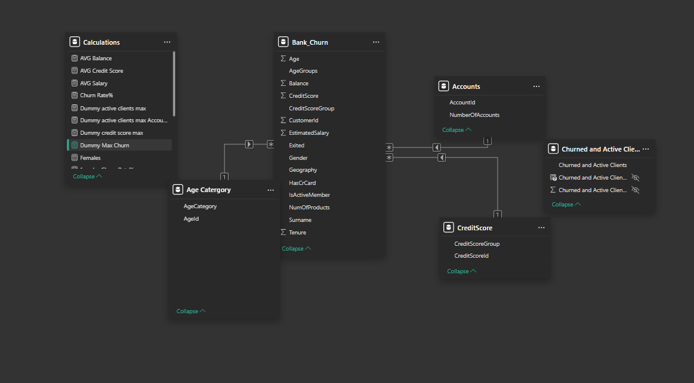
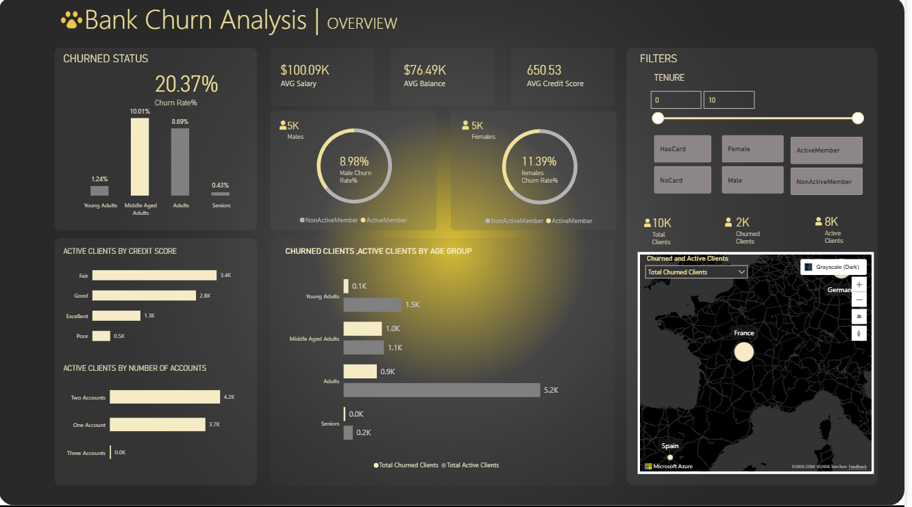

# Churn-Analysis
Customer Bank Churn Analysis

## Table Of Contents

- [ Project Overview ](#Project-Overview)
- [ Data Source ](#Data-Source)
- [ Tools ](#Tools)
- [ Data Extraction and Cleaning ](#Data-Extraction-and-Cleaning)
- [ Data Modelling ](#Data-Modelling)
- [ Data Visualisation ](#Data-Visualisation)
- [ Explanatory Data Analysis](#Explanatory-Data-Analysis)
- [ Findings ](#Findings)

### Project Overview

The project aims to analyze customer churn behavior and its relationship with credit card ownership, age groups, and exit status. The goal is to provide actionable insights for retention strategies, helping stakeholders identify risk factors and improve customer engagement.

### Data Source
The analysis is based on the Bank Churn dataset, provided as a CSV file located in the Bank Churn Source folder within this repository. This dataset contains the relevant customer information required for churn analysis and comparative insights

### Tools & Technologies
- Power BI – for interactive dashboards and visual storytelling.
- Data Modeling – structured relationships between customer demographics, churn status, and credit card indicators.
- DAX Measures – custom calculations for churn rates, age segmentation, and card ownership trends.

### Data Extraction and Cleaning
1. Extract the CSV file (Bank Churn) into Power BI.
2. Load and transform the data using Power Query.
3. Address any missing values.
4. Standardize data formatting.

   ### *Load Data*
   

### Data Modelling
1. Identify and count the number of Dimension Tables (Dim Tables) derived from the Fact Table (Bank Churn).
2. Duplicate the Fact Table based on the identified number of Dimension Tables.
3. Create the necessary Dimension Tables.
4. Normalize the Fact Table and rename it to FactBank_Churn, then close Power Query.
5. Navigate to the modeling page by clicking the leftmost option on the home tab.
6. Establish a Snowflake model by creating relationships between the Fact Table and the Dimension Tables.
7. Use the drag-and-drop method to define these relationships.

   ### *Relationship Model*
  

### Data Visualisation
1. Create a DAX Measures Table containing calculations for report visualizations.
2. Design the report theme.
3. Select appropriate visualizations and format them according to the theme.
4. Conduct testing on the report.

   ### *Dashboard*

### *Dashboard Link*
https://app.powerbi.com/view?r=eyJrIjoiZTEyNTg5NzUtNmNkMC00ZTU1LWFkNDEtMDdlYzhlZDUzNmVhIiwidCI6Ijc1NTE5MmU4LTBiYTAtNDNkMS04NDBhLTBhYjliY2JiOWY4ZSJ9&pageName=507bff44290acbd27917

 

### Explanatory Data Analysis
- Analyze the churn rate , distribution of customers according to Gender,Location,Age range,Membership
- Determine the number Customers with 2 more accounts

### Findings
- Highest number of clients are in France,Most of the banks clients have a low credit score
- Demography of the bank has more Young Adults than Midle Aged Adults

### Recommendation
1. I recommend the bank to focus more on their marketing in Spain and Germany for more client retension
2. Due to High number of Clients with Low credit , I recomend to endorse a low tier loan product to cater for the low credit score customers( minimising the banks loss)
   

